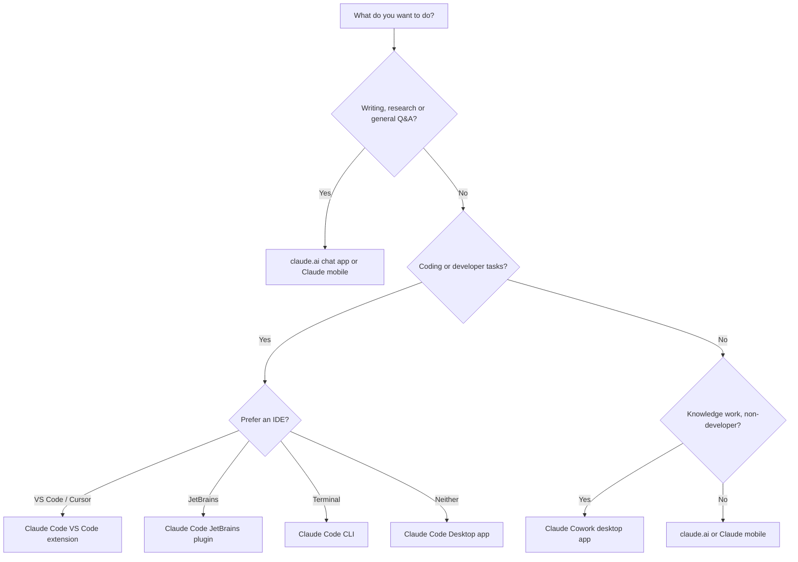

# What is Claude?

Claude is an AI assistant made by Anthropic. You give it text or images, it responds. Unlike a search engine it understands context, writes code, reasons through problems and holds a conversation.

There is no "true intelligence" and no jailbreak that unlocks a hidden version. What you get is a well-trained language model that does its best to be helpful and honest.

---

## Which surface should you use?

Claude comes in several forms. This diagram helps you pick the right one:

---

## Surfaces at a glance

| Surface | What it's for | Who it's for | Install needed? |
|---|---|---|---|
| claude.ai (web and mobile) | Chat, writing, research, Q&A, file analysis | Everyone | No, just sign in |
| Claude Code CLI | AI driven coding in the terminal | Developers in the terminal | Yes (curl install) |
| Claude Code VS Code / Cursor | In-editor coding with diffs | VS Code and Cursor users | Yes (extension) |
| Claude Code JetBrains | In-editor coding | IntelliJ, PyCharm, WebStorm users | Yes (plugin + CLI) |
| Claude Code Desktop app | Visual diff review, parallel sessions, scheduled tasks | Developers who want a GUI | Yes (download) |
| Claude Code Web | Long running tasks in the browser, no local install | Developers on the go | No, just claude.ai/code |
| Claude Cowork | Agentic knowledge work (documents, research, analysis) | Non-developers | Yes (download) |
| Claude in Chrome | Debug live web apps from the browser | Developers | Browser extension |
| @Claude in Slack | Route tasks from team chat | Teams using Slack | Slack app |

---

## If you're new, start here

1. Go to [claude.ai](https://claude.ai) and create an account. Free tier is fine.
2. Type a question or paste something and see what Claude does.
3. Once you're comfortable, check out [Projects](../03-chat-app/index.md#projects) to organize your work.
4. When you want Claude to help you write code, come back for [Claude Code](../04-claude-code/index.md).

**Gotchas**

- Free accounts have usage limits. If you hit them Claude will tell you.
- Claude doesn't browse the web by default. Enable web search in Settings if you need current info.
- There is no unrestricted mode or jailbreak. See [Permissions and safety](../09-permissions-and-safety/index.md) for what people usually mean when they ask about this.

---

> Sources: [code.claude.com/docs/en/overview](https://code.claude.com/docs/en/overview) (fetched 2026-06-17)

Next: [Choosing a model](../02-models/index.md)
