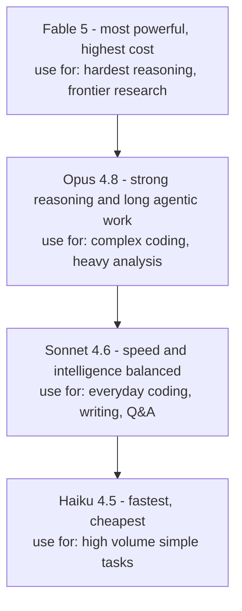

# Choosing a model

Claude has several model tiers. The analogy that makes most sense to me: different workers with different skill levels and hourly rates. You wouldn't hire a senior consultant for something a junior could handle just as well.

---

## The tiers

---

## Current models (June 2026)

| Model | API ID | Context | Speed | Price per 1M tokens (in/out) | Best for |
|---|---|---|---|---|---|
| Fable 5 | `claude-fable-5` | 1M tokens | Moderate | $10 / $50 | Hardest reasoning, frontier work |
| Opus 4.8 | `claude-opus-4-8` | 1M tokens | Moderate | $5 / $25 | Complex agentic coding, long tasks |
| Sonnet 4.6 | `claude-sonnet-4-6` | 1M tokens | Fast | $3 / $15 | Everyday coding, writing, Q&A |
| Haiku 4.5 | `claude-haiku-4-5-20251001` | 200k tokens | Fastest | $1 / $5 | High volume, simple tasks |

Note on Fable 5: it's generally available. Claude Mythos 5 also exists but is invitation only through [Project Glasswing](https://anthropic.com/glasswing), you can't sign up for it.

---

## Which one to pick

Start with **Sonnet 4.6**. It's the default in Claude Code for a reason, fast, smart and affordable. Most tasks don't need more than this.

Go up to **Opus 4.8** when:
- You're doing complex multi-step agentic work (autonomous coding sessions, large refactors)
- Sonnet's answer quality feels noticeably shallow
- You need longer or more nuanced analysis

Use **Fable 5** when:
- Opus 4.8 isn't cutting it and you need the absolute best
- Cost isn't a concern

Drop to **Haiku 4.5** when:
- You're routing many small repetitive tasks (log triage, short summaries)
- You want to keep API costs down
- You're experimenting and don't need high quality output yet

---

## Extended and adaptive thinking

### Extended thinking

Claude writes out its step by step reasoning in a visible block before giving you an answer. Slower but more accurate on hard problems.

Available on Sonnet 4.6 and Haiku 4.5. Good for math, logic, tricky edge cases, planning.

### Adaptive thinking

Claude decides on its own how deeply to think. No config needed, it's always on for Fable 5 and Opus 4.8. It self-scales from quick responses to deep reasoning based on the task.

**Gotchas**

- Model IDs are pinned snapshots, `claude-sonnet-4-6` always points to the same release. This is intentional for production stability.
- A 1M token context window fits roughly 750k words.
- Prices above are for the Claude API (direct billing). A claude.ai subscription is a flat monthly fee instead.

---

> Sources: [platform.claude.com/docs/en/docs/about-claude/models/overview](https://platform.claude.com/docs/en/docs/about-claude/models/overview) (fetched 2026-06-17)

Next: [The chat app](../03-chat-app/index.md) | See also: [Glossary](../glossary.md)
