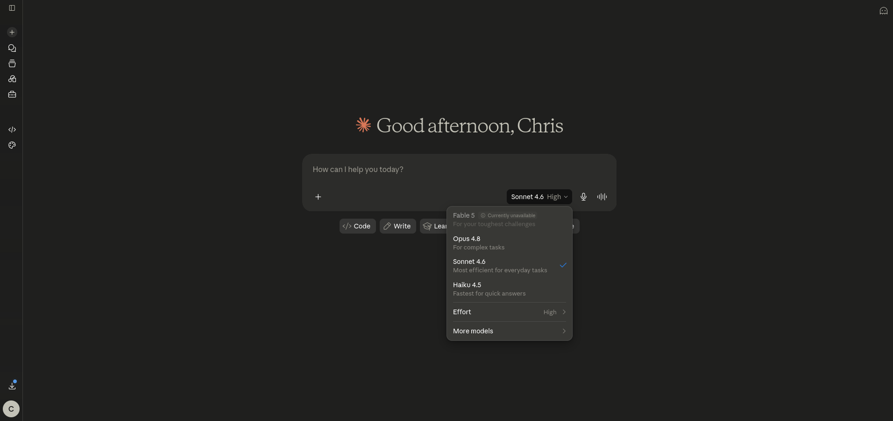
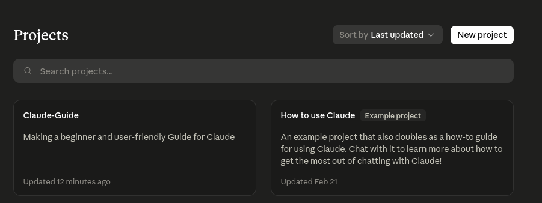
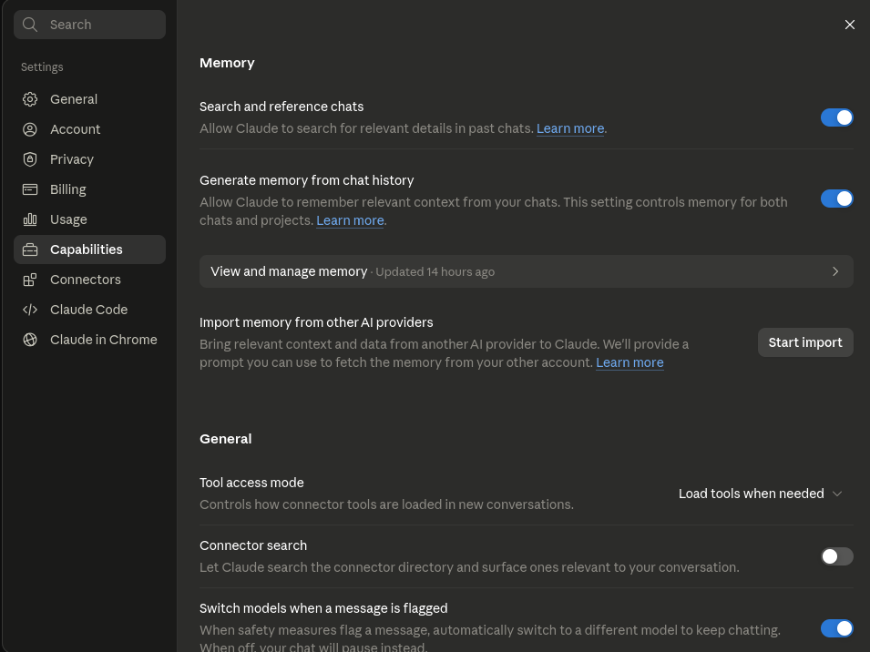
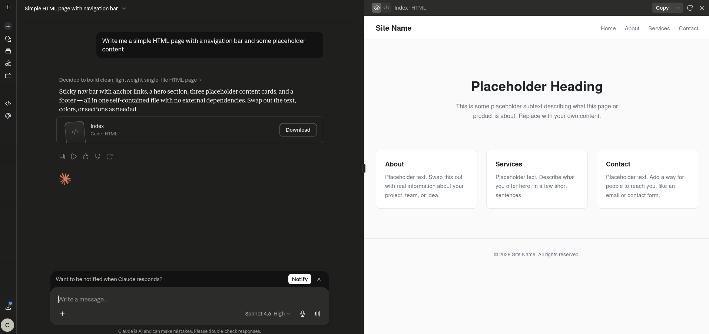
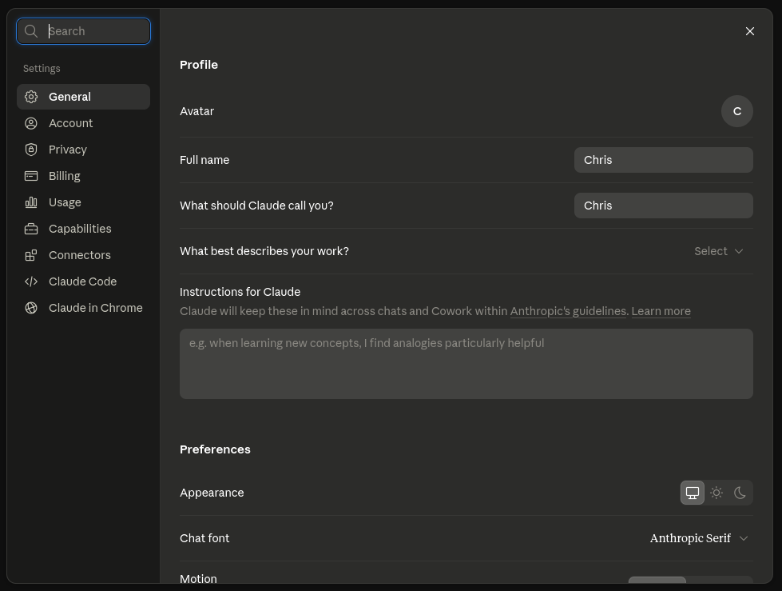

# The chat app (claude.ai)

Claude.ai is the web and mobile interface. No install, no code, just a text box. This covers the features worth knowing beyond the basics.

---

## Web vs desktop vs mobile

All three connect to the same Claude models.

| Surface | What's different |
|---|---|
| Web (claude.ai) | Full featured, works in any browser |
| Desktop app | Slightly faster, native OS notifications |
| iOS / Android | Good for quick questions, voice input works well |

For most purposes the web app is fine. Use mobile when you're away from your desk.

---

## Starting a conversation

Open [claude.ai](https://claude.ai), click New chat and type. A few things that immediately improve results:

- **Be specific.** "Explain async/await in JavaScript to a beginner using a coffee shop analogy" beats "explain async/await."
- **Show the problem.** Paste the error message, the paragraph you want rewritten, or the code you're confused about.
- **Ask for a format.** "Give me a 5 bullet summary" or "write this as a table" tells Claude exactly what you need.



---

## Projects

A Project groups related conversations and lets you give Claude standing context. It's a persistent workspace.

How to use it:
1. Click New Project in the left sidebar.
2. Give it a name.
3. In project settings add Project Instructions, text Claude reads before every conversation in that project.
4. Optionally upload files Claude can reference across conversations.

What belongs in project instructions: the goal of the project, your audience, things Claude should always or never do, relevant facts it would otherwise need to re-learn each time.



---

## Memory

Claude can remember things across conversations. Two kinds:

1. **Project instructions** (you write these, see above)
2. **Saved memories** - Claude builds these from your corrections. View and edit them in Settings > Memory.

To turn memory off for a session, start a Temporary chat (the incognito option). Nothing from that conversation gets saved.



---

## Artifacts

When Claude creates something like a document, code, HTML page or chart it can show it in a separate Artifact panel. You can copy it, download it, or ask Claude to iterate on it without rewriting everything.



---

## Web search

Claude can search the web during a conversation. It doesn't do this by default. Enable it with the globe icon in the message toolbar or in Settings > Features > Web search. Useful for current events or anything that might have changed since Claude's training cutoff.

---

## Settings worth knowing

| Setting | What to know |
|---|---|
| Default model | Set your preferred model. Sonnet 4.6 is a good default. |
| Memory | See what Claude saved, delete individual memories. |
| Privacy | Toggle whether conversations train Anthropic's models. |
| Feature Previews | Early access to new features. Worth checking occasionally. |



---

## Writing better prompts

The fastest way to get better results: describe what you want, what you have and what format you need.

```
I'm writing a blog post about [topic] for [audience].
Here's my draft: [paste it]
Please rewrite this to be more concise and end with a clear call to action.
```

If the response isn't right, tell Claude what to change. "Make it shorter" or "the second paragraph is too technical" works better than starting over.

For more prompting patterns see [Tips and tricks](../08-tips-and-tricks/index.md).

**Gotchas**

- Claude doesn't access URLs you paste unless web search is enabled and it decides to fetch them.
- Uploaded files stay in the conversation but aren't stored permanently unless you're in a Project.
- Context is per conversation. New chat means Claude doesn't remember what you discussed before (unless memory is enabled and it saved something).

---

> Sources: [support.claude.com](https://support.claude.com) (fetched 2026-06-17)

Next: [Claude Code](../04-claude-code/index.md) | See also: [Tips and tricks](../08-tips-and-tricks/index.md)
