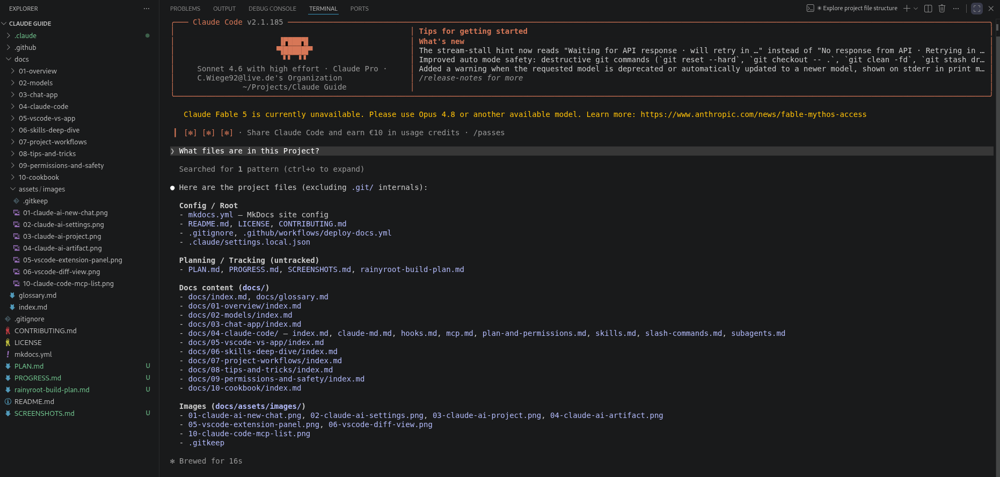
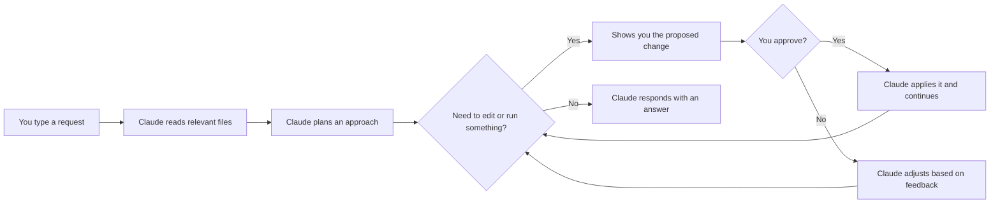

# Claude Code - getting started

Claude Code is an AI coding agent that reads your codebase, edits files, runs commands and integrates with your tools. Unlike the chat app, it has direct access to your local files. No more copying and pasting code back and forth.

Available in the terminal, as a VS Code/JetBrains extension, as a desktop app and in the browser. This chapter covers the terminal CLI. See [VS Code vs terminal vs desktop](../05-vscode-vs-app/index.md) for a comparison.

---

## Requirements

- A claude.ai account (free tier works to try it, a paid plan is needed for sustained use)
- macOS, Linux or Windows (WSL recommended on Windows)

---

## Install

The recommended method is the native installer:

**macOS, Linux, WSL:**
```bash
curl -fsSL https://claude.ai/install.sh | bash
```

**Windows PowerShell:**
```powershell
irm https://claude.ai/install.ps1 | iex
```

Native installs update automatically in the background.

Other options if you prefer:
```bash
# Homebrew (does NOT auto-update)
brew install --cask claude-code

# WinGet (does NOT auto-update)
winget install Anthropic.ClaudeCode
```

To verify the install:
```bash
claude --version
```

---

## First login

Run Claude Code in any directory:
```bash
cd my-project
claude
```

On the first run it opens a browser to log you in. Complete the auth flow, come back to the terminal, done.

---

## First session

```bash
cd my-project
claude
```

Try:
```
> What does this project do? Give me a quick overview.
```

Claude reads your files and summarizes the project. Then:
```
> Find any TODO comments in the codebase and list them.
```

When Claude wants to edit a file it shows you the proposed change and asks for approval before touching anything (in the default mode).



---

## The agent loop

This is how Claude Code works every time:



Key things to know:
- Claude reads files in your project to build context. It doesn't guess, it actually looks.
- Every edit is shown before it's applied (in normal mode).
- Claude can run shell commands like tests and git. These also need approval by default.
- Claude keeps looping until the task is done or it gets stuck.

---

## Useful CLI flags

```bash
claude                              # interactive session
claude "fix the login bug"          # one-shot: run a task and exit
claude -p "summarize this"          # print output only, no interactive session
claude --model claude-opus-4-8      # use a specific model
claude --dangerously-skip-permissions  # skip all approval prompts (read ch.09 first)
```

---

## Stopping and resuming

- `Ctrl+C` to stop Claude mid-task
- `/compact` to summarize the conversation and free up context when it gets long
- `/clear` to start fresh in the same session

**Gotchas**

- Claude Code can run git commands, delete files and make network requests. Read [Plan mode and permissions](plan-and-permissions.md) before running it unsupervised.
- If Claude is going in the wrong direction, say so. "Stop, that's not what I meant." It will adjust.
- Claude doesn't know about files you haven't told it about. Give it context with `/init` or a CLAUDE.md file.

---

> Sources: [code.claude.com/docs/en/overview](https://code.claude.com/docs/en/overview), [code.claude.com/docs/en/quickstart](https://code.claude.com/docs/en/quickstart) (fetched 2026-06-17)

Next: [Plan mode and permissions](plan-and-permissions.md) | See also: [CLAUDE.md](claude-md.md), [VS Code vs terminal](../05-vscode-vs-app/index.md)
