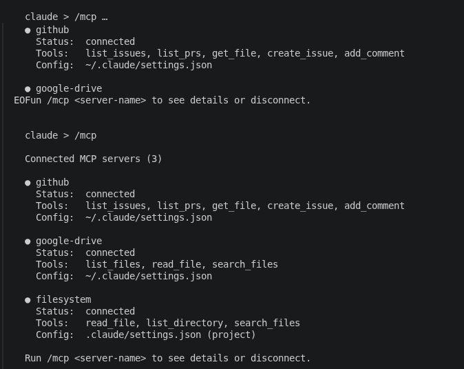

# MCP

MCP (Model Context Protocol) is an open standard for connecting Claude to external data sources and tools. Without MCP, Claude can only read your local files and run shell commands. With MCP it can read your Google Drive, update a Jira ticket, search Slack or call any API you configure.

---

## See what's connected

Run `/mcp` to list all connected MCP servers and their available tools:

```
> /mcp
```

```
Connected MCP servers:
  * github (3 tools: create_issue, list_prs, get_file)
  * google-drive (2 tools: read_file, list_files)
```



---

## Connect an MCP server

MCP servers are configured in your Claude Code settings. The exact syntax depends on the server. Here's an example connecting a filesystem MCP server:

```json
// ~/.claude/settings.json
{
  "mcpServers": {
    "my-notes": {
      "type": "stdio",
      "command": "npx",
      "args": ["-y", "@modelcontextprotocol/server-filesystem", "/Users/you/notes"]
    }
  }
}
```

After saving, restart Claude Code and run `/mcp` to confirm it shows up.

Project-level MCP config goes in `.claude/settings.json` and is committed with the repo so your team shares the same servers.

---

## Using MCP tools

Once connected, just ask Claude naturally:

```
> Find the design doc for the auth refactor in my Google Drive and summarize it.
```

Claude uses the MCP tool, fetches the file and responds. You don't need to know the underlying tool names.

---

## Security

MCP servers run as processes on your machine and can have broad access to external services. Before adding one check:

1. Is it from a known source (Anthropic, a major tool vendor, your own code)?
2. What permissions does it request? Read-only Drive is lower risk than something that can send emails.
3. Are the credentials scoped to only what it needs?

---

## Where to find MCP servers

- Anthropic's examples: [github.com/modelcontextprotocol/servers](https://github.com/modelcontextprotocol/servers)
- Many tools like Notion, Linear, GitHub, Slack have community-built MCP servers on GitHub.
- You can also build your own, the MCP spec is open.

**Gotchas**

- Project-level MCP config in `.claude/settings.json` is committed to git. Don't put credentials there. Use environment variables the MCP server reads at runtime.
- If `/mcp` shows a server as disconnected, check that the server process started correctly.

---

> Sources: [code.claude.com/docs/en/mcp](https://code.claude.com/docs/en/mcp), [code.claude.com/docs/en/mcp-quickstart](https://code.claude.com/docs/en/mcp-quickstart) (fetched 2026-06-17)

Next: [VS Code vs terminal vs desktop](../05-vscode-vs-app/index.md) | See also: [Cookbook recipe E](../10-cookbook/index.md#recipe-e-connect-a-github-mcp-server)
