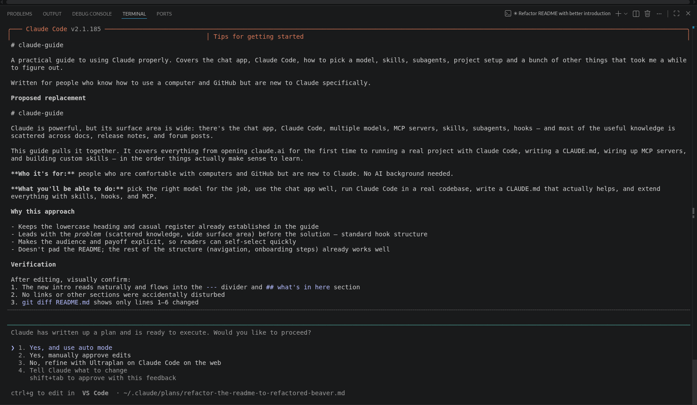

# Plan mode and permissions

Two controls determine how much Claude does before stopping to ask: plan mode (should it plan first?) and permission mode (should it ask before each action?). Getting these right makes a big difference.

---

## Plan mode

By default Claude jumps straight to editing. Plan mode tells it to plan first and show you the plan before touching anything.

Activate with `Shift+Tab` to cycle through modes. The current mode shows in the prompt label.

The three modes:
1. **Normal** - Claude edits files and runs commands, asking for approval before each action.
2. **Auto-accept edits** - Claude edits files without asking, but still asks before running shell commands.
3. **Plan** - Claude reads files and plans, but does NOT edit or run anything. It stops and shows you what it would do.

When to use plan mode:
- Before a large refactor, to see the plan and catch wrong assumptions early
- When you want to understand what Claude would do without committing
- As a review step before executing



Tip: plan mode is especially useful before risky changes. "Make a plan for migrating this database schema" is much safer than "migrate this database schema."

---

## Permission modes

Permission modes control whether Claude stops to ask before taking actions.

### Normal mode (default)

Claude proposes each edit and each shell command separately. You see it and approve or reject. Right default for most work.

```
Claude wants to edit src/auth.py:
  - Line 42: return None  ->  return {"error": "unauthorized"}
[y/n]?
```

### Auto-accept edits

Claude edits files without asking but still asks before running shell commands. Good when you trust the edits but want to review before any git operations or system commands run.

Activate by pressing `Shift+Tab` past Normal.

### Bypass permissions

```bash
claude --dangerously-skip-permissions
```

This is the YOLO mode. Claude skips all approval prompts and will edit files, run commands, commit to git and execute scripts without stopping to ask.

Covered in detail in [Permissions and safety](../09-permissions-and-safety/index.md). Short version: only use this on a throwaway sandbox with no real credentials and nothing you can't afford to lose.

**Gotchas**

- `Shift+Tab` cycles modes in order. Check the prompt label if you lose track of what mode you're in.
- Plan mode does not prevent Claude from reading files. It can read extensively, just not write.
- Auto-accept applies to file writes. It does not skip prompts for destructive shell commands.

---

> Sources: [code.claude.com/docs/en/overview](https://code.claude.com/docs/en/overview) (fetched 2026-06-17)

Next: [CLAUDE.md](claude-md.md) | See also: [Permissions and safety (full chapter)](../09-permissions-and-safety/index.md)
