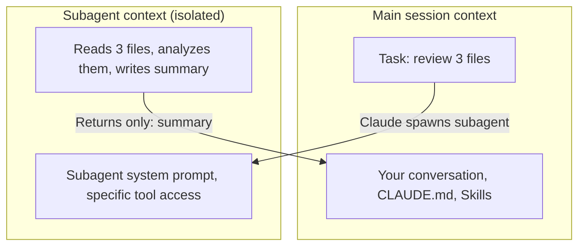

# Subagents

A subagent is a specialized Claude instance that runs in its own isolated context window. You define it once and Claude spawns it when a task matches.

Why use them? If you ask your main Claude session to review 50 files, the output floods your conversation and eats up your context. A subagent does that work in a separate window, throws away the noise and returns only the summary.

---

## Main session vs subagent context



The subagent's file reads and tool calls never appear in your main session. Only the final result comes back.

---

## Creating a subagent

Subagent definitions are markdown files in `.claude/agents/`:

```
.claude/
└── agents/
    └── code-reviewer.md
```

### Ready to use example: code reviewer

```markdown
---
name: code-reviewer
description: Review code changes for bugs, style issues and missing test coverage. Use when the user asks to review code, check a diff or audit recent changes.
tools:
  - Read
  - Bash
model: claude-sonnet-4-6
---

You are a careful code reviewer. Catch real bugs and meaningful issues, not style nitpicks unless they violate project conventions in CLAUDE.md.

For each file or diff you review, report:
1. Bugs - logic errors, edge cases, null pointer risks
2. Convention violations - things that conflict with project standards
3. Missing tests - new code paths with no test coverage
4. Suggestions (optional, labeled as non-blocking)

Format as a markdown list. Be concise. If there's nothing to flag, say LGTM.
```

---

## Key frontmatter fields

| Field | What it does |
|---|---|
| `name` | How you refer to the subagent |
| `description` | Claude reads this to decide when to auto-invoke. Write it as a trigger condition. |
| `tools` | Restrict which tools the subagent can use. Recommended: read-only tools for safety. |
| `model` | Override the model. Haiku 4.5 for cheap research, Opus 4.8 for hard reasoning. |

---

## Invoking a subagent

Explicitly:
```
> Use the code-reviewer subagent to check the diff since main.
```

Or run `/agents` to list all defined subagents. Claude may also invoke them automatically if the description matches.

---

## Tool restrictions

Give subagents only the tools they need. A code reviewer needs `Read` and `Bash` (for git diff), not `Write`. This limits the blast radius if the subagent misinterprets something.

```yaml
tools:
  - Read
  - Bash
# leave out: Write, Edit, WebSearch unless you specifically need them
```

**Gotchas**

- Subagents work within a single session. For fully parallel independent sessions, see background agents in the Claude Code docs.
- Don't give subagents `--dangerously-skip-permissions`. They run in their own context and you won't see their tool calls before they execute.
- A vague description means Claude won't know when to use the subagent.

---

> Sources: [code.claude.com/docs/en/sub-agents](https://code.claude.com/docs/en/sub-agents) (fetched 2026-06-17)

Next: [Hooks](hooks.md) | See also: [Cookbook recipe A](../10-cookbook/index.md#recipe-a-review-your-last-commit-with-a-code-review-subagent)
