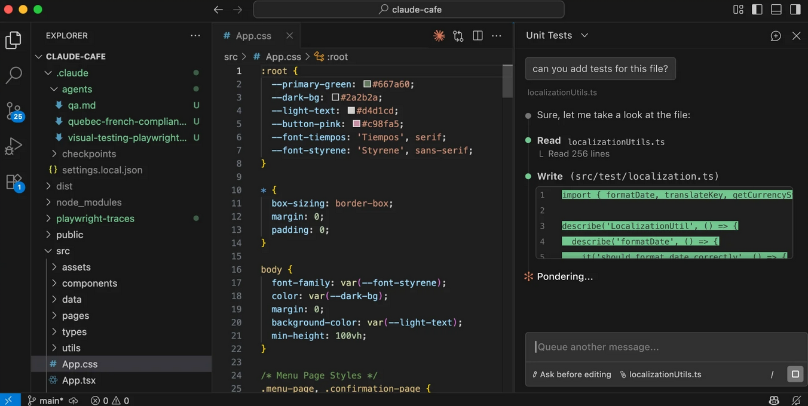
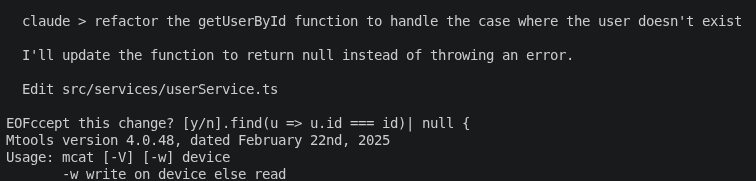

# VS Code vs terminal vs desktop vs web

Claude Code runs in multiple environments. Here's how to pick the right one.

---

## Comparison

| Surface | Best for | Diff experience | Learning curve |
|---|---|---|---|
| Terminal CLI | Full control, scripting, CI, piping | Text output in terminal | Low (just `claude`) |
| VS Code extension | In-editor workflow, inline diffs, code selection | Side-by-side in VS Code | Low if you already use VS Code |
| Cursor extension | Same as VS Code, works natively in Cursor | Same as VS Code | Low |
| JetBrains plugin | IntelliJ, PyCharm, WebStorm users | Interactive diff view | Medium (needs CLI + plugin) |
| Desktop app | Visual diff review, parallel sessions, scheduled tasks | Visual side-by-side GUI | Low |
| Web (claude.ai/code) | No local install, long tasks, repos you don't have locally | Browser based | Lowest, browser only |

---

## Terminal CLI

The most full-featured option. Everything in this guide works in the terminal. Use it if:

- You're already comfortable with a terminal
- You want to pipe output: `tail -100 app.log | claude -p "any anomalies?"`
- You're running Claude Code in CI or scripts
- You want to combine Claude with other shell tools

```bash
# one-shot (no interactive session)
claude -p "write a test for the login function"

# pipe a file
cat src/auth.ts | claude -p "explain this"

# interactive session
cd my-project && claude
```

---

## VS Code extension

Install from the [VS Code Marketplace](https://marketplace.visualstudio.com/items?itemName=anthropic.claude-code) or search "Claude Code" in Extensions (`Ctrl+Shift+X` on Windows/Linux, `Cmd+Shift+X` on Mac).

What you get over the terminal:
- **Inline diffs** proposed edits appear in the VS Code diff view, not just as text
- **@-mentions** type `@filename` or `@selection` to give Claude explicit context
- **Plan review** approve or reject Claude's plan in a visual panel
- **Conversation history** see past sessions in the panel

Open Claude Code via the Command Palette: `Cmd+Shift+P` / `Ctrl+Shift+P` -> Claude Code: Open in New Tab.




Best for: anyone already using VS Code or Cursor. The diff experience is significantly better than the terminal.

---

## JetBrains plugin

Install the [Claude Code plugin](https://plugins.jetbrains.com/plugin/27310-claude-code-beta-) from the JetBrains Marketplace. The CLI also needs to be installed separately.

What you get: interactive diff viewing and the ability to share your current selection as context. Works in IntelliJ, PyCharm, WebStorm and other JetBrains IDEs.

Best for: developers already on a JetBrains IDE.

---

## Desktop app

Download from [claude.ai/code](https://claude.ai/code).

What the desktop app adds:
- Visual diff review in a proper GUI
- Multiple Claude Code sessions side by side
- Dispatch send a task from your phone and open the session on desktop
- Scheduled tasks that run on your machine
- Hand off from terminal: type `/desktop` in a terminal session

Best for: developers who want a visual interface without VS Code, or who run multiple sessions at once.

---

## Web (claude.ai/code)

No install needed. Open [claude.ai/code](https://claude.ai/code) in any browser.

Best for:
- Quick tasks on a machine where Claude Code isn't installed
- Long tasks you kick off and come back to later
- Working on GitHub repos you don't have locally
- Running multiple tasks in parallel

Limitation: you're working on a remote environment, not your local files. For local file access use the terminal or an IDE extension.

---

## Which one to start with

If you already use VS Code: install the [VS Code extension](https://marketplace.visualstudio.com/items?itemName=anthropic.claude-code). Most beginner friendly, you see diffs in a familiar interface.

If you live in the terminal: use the CLI. Run `curl -fsSL https://claude.ai/install.sh | bash` and you're set.

If you want to try it without installing anything: go to [claude.ai/code](https://claude.ai/code) in your browser.

---

## Moving between surfaces

Sessions aren't locked to one surface:
- Terminal to Desktop: type `/desktop` in a terminal session to open it in the Desktop app.
- Web to Terminal: start a task on the web, then `claude --teleport` in a terminal to pull it down locally.
- Mobile to Desktop: send a task via Dispatch on your phone, it opens in the Desktop app.

**Gotchas**

- CLAUDE.md files, settings and MCP servers work across all surfaces, they're read from your local filesystem.
- The VS Code extension requires the CLI to be installed first.
- The web surface runs Claude in a remote environment. Local files are not accessible unless you explicitly share them.

---

> Sources: [code.claude.com/docs/en/overview](https://code.claude.com/docs/en/overview), [code.claude.com/docs/en/vs-code](https://code.claude.com/docs/en/vs-code) (fetched 2026-06-17)

Next: [Skills deep dive](../06-skills-deep-dive/index.md) | See also: [Claude Code getting started](../04-claude-code/index.md)
