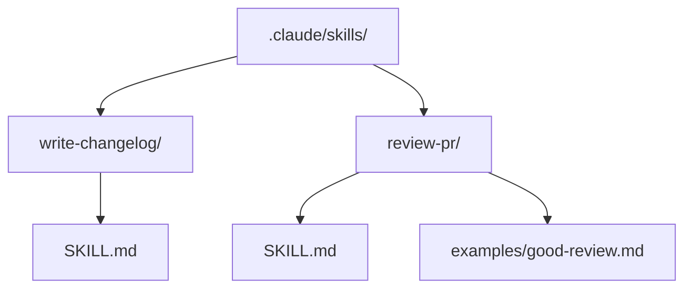

# Skills deep dive

Skills are reusable workflows you build once and share with your team. More powerful than a custom command because they can include context files, reference supporting scripts and be auto-invoked by Claude when it recognizes the task type.

---

## SKILL.md anatomy

```
.claude/
└── skills/
    └── my-skill/
        ├── SKILL.md          <- required
        └── supporting-file   <- optional (scripts, templates, examples)
```

A SKILL.md has two parts: YAML frontmatter (configuration) and the skill body (instructions Claude follows when invoked).

```markdown
---
name: conventional-commit
description: Write a conventional commit message for the current staged changes. Use this whenever the user asks to commit, write a commit message or save their changes.
---

Look at `git diff --staged` to see what changed.

Write a conventional commit message:

Format:
  <type>(<scope>): <short description under 72 chars>

  [optional body: why this change, not what the code does]

  [optional footer: BREAKING CHANGE: ..., Closes #123]

Types:
  feat     new feature
  fix      bug fix
  docs     documentation only
  refactor code change that is not a fix or feature
  test     adding or fixing tests
  chore    build, tooling or maintenance

Print the message and ask me to confirm before running `git commit -m "..."`.
```

---

## The description field

This is the most important field. Claude reads it to decide whether to auto-invoke the skill. Write it as a trigger:

```
# Good
description: Write a PR description for the current branch based on the git log since main.

# Good
description: Run a security audit on staged changes. Use when the user mentions security, vulnerabilities or asks to audit.

# Bad
description: Helps with code review.
```

A vague description means Claude won't know when to use the skill. A clear one means you often don't even need to type `/skill-name`.

---

## Build your first skill: write-changelog

```bash
mkdir -p .claude/skills/write-changelog
```

```markdown
---
name: write-changelog
description: Generate a changelog entry for the current release. Use when the user asks to write a changelog, document what changed or prepare release notes.
---

Run `git log --oneline --no-merges $(git describe --tags --abbrev=0)..HEAD` to get commits since the last tag.

Group them into:
- **Added** - new features (feat: commits)
- **Fixed** - bug fixes (fix: commits)
- **Changed** - refactors and improvements (refactor:, perf: commits)
- **Removed** - deleted functionality

Format the output as:

\`\`\`
## [Unreleased] - YYYY-MM-DD

### Added
- ...

### Fixed
- ...
\`\`\`

Ask me to confirm before writing to CHANGELOG.md.
```

Use it:
```
> /write-changelog
```

Or just: "Can you write up what changed since the last release?" and Claude may invoke it automatically.

---

## Folder structure



Supporting files in the skill folder can be referenced inside the skill body.

---

## Personal vs project skills

| Location | Scope | Use for |
|---|---|---|
| `.claude/skills/` | This project only | Team workflows |
| `~/.claude/skills/` | All your projects | Personal workflows |

Project skills override user-level skills with the same name.

---

## Bootstrap a new skill with Claude

The fastest way to get started:

```
> I want a skill that reviews React components for WCAG AA accessibility compliance.
> Create a SKILL.md in .claude/skills/a11y-review/.
```

Review the description and body, adjust what you need, then use it.

**Gotchas**

- Skills are discovered automatically, no restart needed after creating one.
- The `name` must be lowercase with hyphens only. `write-changelog` becomes `/write-changelog`.
- Skills load into the current session when invoked. They don't use context just by existing.

---

> Sources: [code.claude.com/docs/en/skills](https://code.claude.com/docs/en/skills) (fetched 2026-06-17)

Next: [Project workflows](../07-project-workflows/index.md) | See also: [Skills overview](../04-claude-code/skills.md), [Cookbook recipe B](../10-cookbook/index.md#recipe-b-build-your-first-skill)
