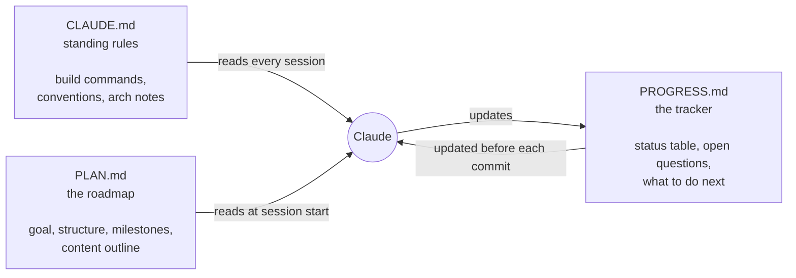

# Project workflows

The difference between a productive Claude Code session and a frustrating one is usually how well the project is set up, not how smart the model is. This covers the workflow that makes Claude effective: the CLAUDE.md + PLAN.md + PROGRESS.md trio, clean file structure and git hygiene.

---

## The three-file trio



Each file has a different job:

| File | Who writes it | When Claude reads it | Purpose |
|---|---|---|---|
| CLAUDE.md | You (+ `/init`) | Every session | Standing rules that never change |
| PLAN.md | You | Each session when you reference it | Big picture: what are we building and why |
| PROGRESS.md | Claude + you | Checkpoints | What's done, what's next, open questions |

---

## CLAUDE.md: the project's memory

Put things here that are true for every session:

```markdown
# my-api

## Setup
- Install: `npm install`
- Dev server: `npm run dev` (port 3000)
- Tests: `npm test`
- Lint: `npm run lint` (required before committing)

## Conventions
- Handlers: `src/handlers/<name>.ts`
- Error format: { error: "message", code: "SCREAMING_SNAKE" }
- Never commit to main directly

## Architecture
- Express + TypeScript
- Auth: JWT, 24h expiry
- DB: PostgreSQL via Prisma
```

Don't add "for this task" context here. That belongs in the conversation or PLAN.md.

---

## PLAN.md: the roadmap

Write this before starting a session with Claude. It gives Claude the context to make good decisions without you re-explaining goals every time.

A minimal PLAN.md:

```markdown
# Project: user auth API

## Goal
Add JWT-based auth (register, login, refresh, logout) to the existing Express app.
No third-party auth libs. Implement from scratch with argon2 + jsonwebtoken.

## File structure (planned)
src/
  handlers/auth/
    register.ts
    login.ts
    refresh.ts
    logout.ts
  middleware/authenticate.ts
  services/authService.ts

## Milestones
- [ ] Schema: users table migration
- [ ] Register endpoint
- [ ] Login endpoint
- [ ] JWT middleware
- [ ] Refresh and logout
- [ ] Tests

## Not in scope
- OAuth / social login
- Email verification (later)
```

---

## PROGRESS.md: the tracker

Update before every meaningful commit.

```markdown
# PROGRESS.md

## Status

| Milestone | Status | Date | Commit | Notes |
|---|---|---|---|---|
| Schema: users table | done | 2026-06-10 | abc123 | |
| Register endpoint | done | 2026-06-11 | def456 | |
| Login endpoint | doing | | | Started, tests failing |
| JWT middleware | todo | | | |
| Refresh and logout | todo | | | |
| Tests | todo | | | |

## Open questions
- Do refresh tokens expire? (decision: yes, 30d, stored in DB)
- Rate limiting on login? (todo: add after core works)
```

At the start of each new session:
```
> Read PROGRESS.md and continue from the last in-progress milestone.
```

---

## How to structure a new project for Claude

A clean structure makes Claude much more effective:

1. **Small modules.** One file per thing. A 1000 line file is harder to reason about than three 300 line files.
2. **Predictable locations.** If handlers always live in `src/handlers/`, say so in CLAUDE.md.
3. **Tests next to code.** `auth.ts` and `auth.test.ts` in the same directory.
4. **One concern per directory.** `handlers/`, `services/`, `middleware/` with clear boundaries.

---

## Git hygiene with an AI

An AI that writes code quickly can also create a mess of commits quickly.

**Commit after every logical unit.** Don't let Claude accumulate 20 file changes before the first commit.

**Use conventional commits:**
```bash
git commit -m "feat(auth): add JWT login endpoint"
git commit -m "fix(auth): handle expired token gracefully"
git commit -m "test(auth): add integration tests for login"
```

**Review diffs before every commit.** `git diff --staged` takes 30 seconds and catches mistakes.

**Keep branches short lived.** Small PRs are easier to review and easier to revert.

**Push at milestones.** After each PROGRESS.md checkpoint, commit and push. If something goes wrong you have a recent fallback.

**Gotchas**

- Don't put secrets in PLAN.md or PROGRESS.md if they're in a public repo.
- PROGRESS.md drifts if you don't update it. Make it a habit: update before any commit.
- CLAUDE.md grows over time. Review it every few weeks and cut anything no longer true.

---

> Sources: [code.claude.com/docs/en/best-practices](https://code.claude.com/docs/en/best-practices) (fetched 2026-06-17)

Next: [Tips and tricks](../08-tips-and-tricks/index.md) | See also: [CLAUDE.md memory](../04-claude-code/claude-md.md), [Skills deep dive](../06-skills-deep-dive/index.md)
